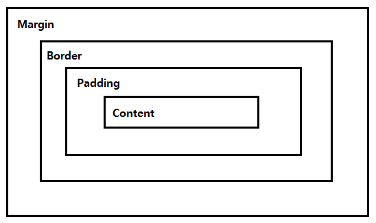

# HTML

> : 웹 페이지가 어떻게 구조화되어 있는지 알 수 있도록 하는 마크업 언어.
>
> Hyper Text Markup Language
>
> * Hyper Text : 비 선형적 텍스트 - 하이퍼링크를 통해 텍스트 이동
>
> * Markup Language : 태그 등을 이용하여 문서나 데이터의 구조를 명시하는 언어
>
> => 웹 페이지를 작성하기 위한(구조를 잡기 위한) 언어. **웹 컨텐츠의 의미와 구조를 정의**

### HTML 기본 구조

```html
<!DOCTYPE html>
<html lang="ko">   -> html 요소
<head>   -> head 요소
    <meta charset="UTF-8">
    <title>Document</title>
</head>
<body>   -> body 요소

</body>
</html>
```

* **html 요소** : HTML문서의 최상위 요소. 문서의 root를 뜻한다. head와 body 부분으로 구분

* **head 요소** : 문서 제목, 문자 코드 등의 문서 정보를 담고 있으며, 브라우저에 나타나지 않는다.

  ​					CSS 선언 혹은 외부 로딩 파일 지정 등도 작성

  * 메타데이터(metadata) : 다른 데이터를 설명해 주는 데이터. 데이터를 표현하기 위한 목적과 데이터를 빨리 찾기 위한 목적으로 사용
    * HTML 문서의 메타 데이터를 통해 문서의 정보를 전달

* **body 요소** : 브라우저 화면에 나타나는 정보로 실제 내용에 해당

* **DOM**(Document Object Model) **트리** : 부모 관계, 형제 관계

* **요소**(element) : 태그 + 내용(content) `<시작태그>content</종료태그>`

* **속성**(attribute) : 태그별로 사용할 수 있는 속성 다름 `<a href(속성명)="http://..."(속성값)></a>` 

  * 속성명="속성값" -> 공백x, 쌍따옴표 사용
  * HTML Global Attribute : 모든 HTML 요소가 사용할 수 있는 공통 속성
    * `id` `class` `hidden` `lang` `style` `tabindex` `title` ....

* `시맨틱 태그` : 의미론적 요소를 담은 태그. ~~`div`~~

  * 의미 있는 정보의 그룹을 태그로 표현
    * header : 문서 전체나 섹션의 헤더(머릿말 부분)
    * nav : 네비게이션
    * aside : 사이드에 위치한 공간(메인 콘텐츠와 관련성이 적은 콘텐츠)
    * section : 문서의 일반적인 구분(그룹)
    * article : 독립적으로 구분되는 영역
    * footer : 문서 전체나 섹션의 푸터(마지막 부분)
  * h1, table 태그 들도 시맨틱 태그
  * div, span -> non semantic 요소

### HTML 문서 구조화

* 인라인 / 블록 요소
* 그룹 컨텐츠
  * `<p>` : 문단 구분
  * `<hr>` : 가로줄
  * `<ol>` : 정렬된 목록(숫자 목록)
  * `<ul>` : 정렬되지 않은 목록(불릿)
  * `<pre>` : HTML에 작성한 내용 그대로 표현. 요소 내 공백 그대로 유지
  * `<blockquote>` : 인용문
  * `<div>` : 통용 블록 컨테이너
* 텍스트 관련 요소
  * `<a>` : 하이퍼링크
  * `<b>` vs `<strong>` : 굵은 글씨체 (중요도x vs 중요도o)
  * `<i>` vs `<em>` : 기울임체 (강조x vs 강조o)
  * `<span>` : 통용 인라인 컨테이너
  * `<br>` : 줄바꿈
  * `` : 이미지 넣기
    * `src` : 필수. 이미지 경로 지정
    * `alt` : 오류 시 이미지 대체 문구
* table
  * `<tr>` `<td>` `<th>` : 테이블의 행 / 셀 / 헤더
  * `<thead>` `<tbody>` `<tfoot>` : 각 열의 헤드를 나타내는 행 / 표의 여러 행을 묶어서 표 본문 구성 / 각 열의 종합을 나타내는 행
  * `<caption>` : 표의 설명 또는 제목
  * 셀 병합 속성 : colspan, rowspan
  * scope 속성
  * `<col>` `<colgroup>` :  표의 열, 열에 속하는 칸에 공통된 의미를 부여 / 표의 열을 묶는 그룹
* form
  * `<form>` : 서버에서 처리될 데이터를 제공하는 역할
  * `<form>` 기본 속성
    * `action` : 데이터를 처리할 프로그램의 URL
      * `<button>` `<input type="submit">` `<input type="image">` 로 재정의 가능
    * `method` : 양식을 제출할 때 사용할 HTTP 메서드
      * `POST` 
      * `GET`
* input
  * `<input>` : 입력 데이터 필드. 사용자의 데이터를 받을 수 있는 대화형 컨트롤 생성

---------------

# CSS

> : 사용자에게 문서를 표시하는 방법을 지정하는 언어
>
> Cadcading Style Sheets
>
> => 스타일, 레이아웃 등을 통해 문서(HTML)를 표시하는 방법을 지정하는 언어

### CSS 구문

```css
선택자(Selector) {
    속성(Property) : 값(Value);  -> 선언(Declaration)
}
```

### CSS 정의 방법

1. 인라인(inline)

   : 해당 태그에 직접 style 속성을 활용

   ```html
   <div style="background-color : red;"></div>
   ```

   * 관리하기 힘듦

2. 내부 참조(embedding) - `<style>`

   : head 태그 내에 `<style>` 에 지정

   ```html
   <style>
       h1 {
           color : blue;
           font-size : 100px;
       }
   </style>
   ```

   * 하나의 html 에서만 적용 가능

3. 외부 참조(link file) - 분리된 CSS 파일

   : 외부 CSS 파일을 `<head>` 내 `<link>` 를 통해 불러오기

   ```html
   <link rel="stylesheet" href="mystyle.css">
   ```

   * 필요한 html 문서마다 적용 가능
   * 유지보수 쉬움
   * CSS 파일을 따로 관리해야 함

### CSS selector

선택자 : HTML 문서에서 특정한 요소를 선택하여 스타일링 하기 위해서 필요

* 기초 선택자

  * 전체 선택자, 타입 선택자(요소, 태그)
  * 클래스 선택자, 아이디 선택자(해당 html 문서상 하나만 있도록 정의해야 함), 속성 선택자

* 고급 선택자

  * 자손 선택자 : 하위의 모든 요소 (띄어쓰기로 구분)

    `선택자1 선택자2 { 속성:속성값 }` `article p { color:red }`

  * 자식 선택자 : 바로 아래의 요소 ( > 로 구분)

    `선택자1 > 선택자2 { 속성:속성값}` `div > p { color:blue }`

  * 형제 선택자 : 같은 레벨에 있는 요소 ( ~ 로 구분)

    `선택자1 ~ 선택자2 { 속성:속성값 }` `p ~ section { color:blue }` 

  * 인접 형제 선택자 : 바로 붙어 있는 형제 요소 ( + 로 구분)

    `선택자1 + 선택자2 { 속성:속성값 }` `div + p { color:blue }`

**CSS 적용 우선순위**

!important > 인라인(태그에 직접 스타일 적용한 것) > id 선택자 > class 선택자 > 요소 선택자 > 소스 순서

```html
<!DOCTYPE html>
<html lang="en">
  <head>
    <meta charset="UTF-8" />
    <meta name="viewport" content="width=device-width, initial-scale=1.0" />
    <title>Document</title>
    <link rel="stylesheet" href="order.css" />
  </head>
  <body>
    <p>1</p>
    <p class="blue">2</p>
    <p class="blue green">3</p>
    <p class="green blue">4</p>
    <p id="red" class="blue">5</p>
    <h2 id="red" class="blue">6</h2>
    <p id="red" class="blue" style="color: yellow;">7</p>
    <h2 id="red" class="blue" style="color: yellow;">8</h2>
  </body>
</html>
```

```css
h2 {
  color: darkviolet !important;
}

p {
  color: orange;
}

.blue {
  color: blue;
}

.green {
  color: green;
}

#red {
  color: red;
}
```

```
1 -> orange
2 -> blue
3 -> green
4 -> green
5 -> red
6 -> darkviolet
7 -> yellow
8 -> darkviolet
```

**CSS 상속**

CSS는 부모 요소의 속성을 자식에게 상속한다. **모두 상속되는 것은 아님!!**

* 상속 되는 것 : Text 관련 요소(font, color, text-align) 등
* 상속 되지 않는 것 : Box model 관련 요소(width, height, margin, padding, border, box-sizing, display), position 관련 요소(position, top/right/bottm/left, z-index) 등

### CSS 단위

**(상대) 크기 단위**

* px : 픽셀

* % : 기준 사이지에서 배율

* em : 상속받은 사이즈에서 배수

* rem : root 사이즈(최상위 요소-html)에서 배수

* Viewport 기준 단위

  viewport : 화면 display 상의 표시 영역

  * vw : 뷰포트 너비의 1%
  * vh : 뷰포트 높이의 1%
  * vmin : 뷰포트 가로세로 중 짧은 쪽의 1%
  * vmax : 뷰포트 가로세로 중 넓은 쪽의 1% 

**색상 단위**

1. 색상 키워드

   `{ color: black; }`

2. RGB 색상

   * '#' + 16진수 표기법 `{ color: #000;}`
   * rgb( ) 함수형 표기법  `{ color: rgb(0, 0, 0); }`

3. HSL 색상

   `{ color: hsl(120, 100%, 0) }`

### CSS Box model



* Margin : 테두리 바깥의 외부 여백
  * 배경색 지정 불가
* Border : 테두리 영역
* Padding : 테두리 안쪽의 내부 여백
  * 요소에 적용된 배경색, 이미지는 padding까지 적용
* Content : 글이나 이미지 등 요소의 실제 내용

**shorthand**

```css
margin: 10px;  -> 상하좌우
margin: 10px 20px;  -> 상하 / 좌우
margin: 10px 20px 30px;  ->  상 / 좌우 / 하
margin: 10px 20px 30px 40px; -> 상 / 우 / 하 / 좌
```

**box-sizing**

* 기본적으로 box-sizing => content box

* 우리는 border까지의 너비를 box-size로 보기를 원함 : box-sizing => border-box

  ```css
  .box-sizing {
    box-sizing: border-box;
  }
  ```

* 마진 상쇄 (Margin collapsing)

  * 인접 형제 요소 간의 margin이 겹쳐서 보임
  * 수직 간의 형제 요소에서 주로 발생
  * margin 대신 padding 을 이용해서 해결 가능 

### CSS block vs inline

**display: block**

* 줄 바꿈이 일어나는 요소
* 화면 크기 전체의 가로 폭을 차지
* 블록 레벨 요소 안에 인라인 레벨 요소가 들어갈 수 있음

* 블록 레벨 요소
  * div / ul, ol, li / p / hr / form ...

**display: inline**

* 줄 바꿈이 일어나지 않는 행의 일부 요소
* content 너비만큼 가로 폭을 차지
* width, height, margin-top, margin-bottom을 지정할 수 없음
* 상하 여백은 line-height로 지정

* 인라인 레벨 요소
  * span / a / img / input, label / b, em, i, strong ...

**display: inline-block**

* inline처럼 한 줄에 표시 가능(컨텐츠 너비 만큼 공간 차지)
* block처럼 width, height, margin 속성 지정 가능

**속성에 따른 수평 정렬**

```css
margin-right: auto;  =  text-align: left;

margin-left: auto;  =  text-align: right;

margin-right: auto;
margin-left: auto;  =  text-align: center;
```

### CSS Position

**static**

* 디폴트 값(기준 위치)
* 기본적인 요소의 배치 순서에 따름(좌측 상단)
* 부모 요소 내에서는 부모 요소의 위치를 기준으로 배치

**relative**

* static 위치를 기준으로 이동 (상대 위치)

  `position: relative;`

**absolute**

* static이 아닌 가장 가까이 있는 부모/조상 요소를 기준으로 이동 (절대 위치)

  `position: absolute;`

**fixed**

* 부모 요소와 관계 없이 브라우저를 기준으로 이동 (고정 위치)

* 스크롤시에도 항상 같은 곳에 위치

  `position: fixed;`